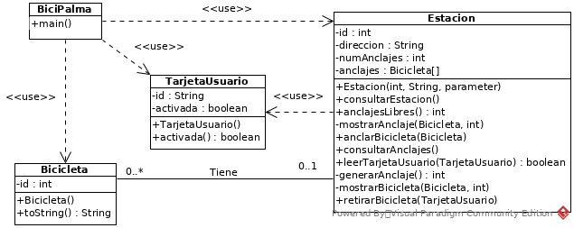

# Proyecto bicipalma

Este proyecto es un examen de años anteriores, el programa trata sobre la administración de estaciones de bicipalma donde se proporcionan bicicletas a los ciudadanos.

El programa asigna una bicicleta aleatoria a una persona y al desancla, también es capaz de registrar que bicicletas y en que posición se encuentran.

## Diagrama de clases

## Historias de usuario

Historia de usuario | Rol | Objetivo | Porque
--- | --- | --- | ---
1 | Cliente | Ver el estado y anclajes de la estacion | Para ver si hay bicicletas
2 | Cliente | Anclar bicicletas | Para poder devolver la bicicleta a la estación
3 | Cliente | Retirar bicicleta | Para poder desplazarse con ella
4 | Estación | Comprobar si la tarjeta esta activada | Para poder asignarle una bicicleta

###### José María Samos Diago